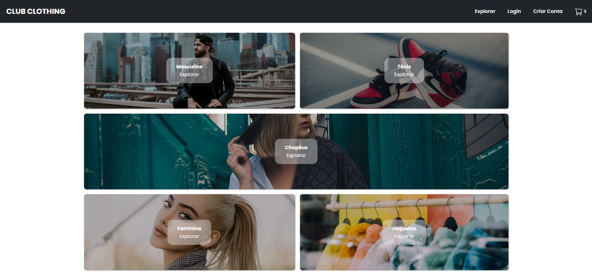
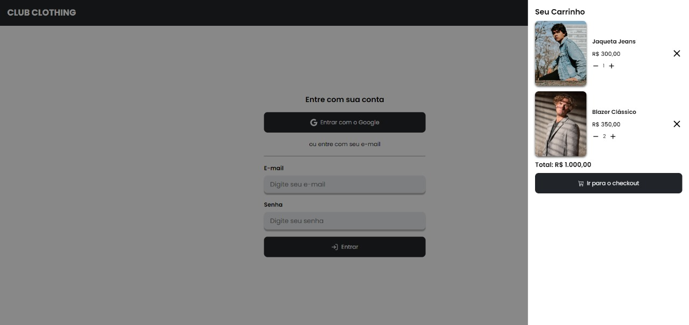

<h1 align="center" style="font-weight: bold;">E-commerce Firebase 💻🔥</h1>

<p align="center">
 <a href="#tech">Technologies</a> • 
 <a href="#started">Getting Started</a> • 
</p>

<p align="center">
    <b>E-commerce project with firebase that lists products using fire base's fire store service. Enables authentication with firebase auth using google and credentials. Uses state management with redux or context api depending on the cloned branch.</b>
</p>

<p align="center">
     <a href="https://github.com/KaianDev/e-commerce-firebase">📱 Visit this Project</a>
</p>

<h2 id="layout">🎨 Layout</h2>

<p align="center">
    
    
</p>

<h2 id="technologies">💻 Technologies</h2>

- react
- styled components
- firebase
- contextAPI
- redux
- react-hook-form
- eslint

<h2 id="started">🚀 Getting started</h2>

```bash
npm install
```

<h3>Prerequisites</h3>

- [NodeJS](https://github.com/)

<h3>Cloning</h3>

How to clone your project

```bash
git clone https://github.com/KaianDev/e-commerce-firebase
```

<h3>Starting</h3>

How to start your project

```bash
cd e-commerce-vite
npm run dev
```
